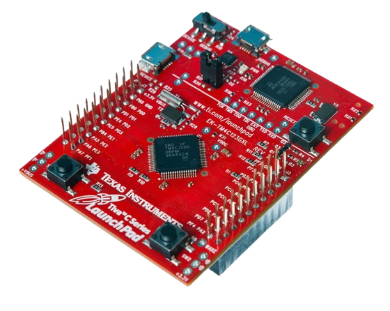
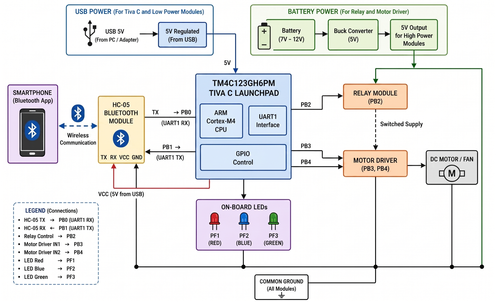
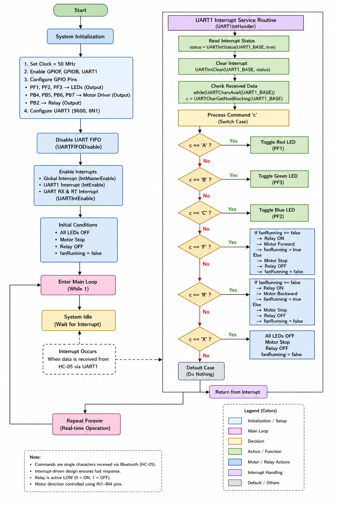
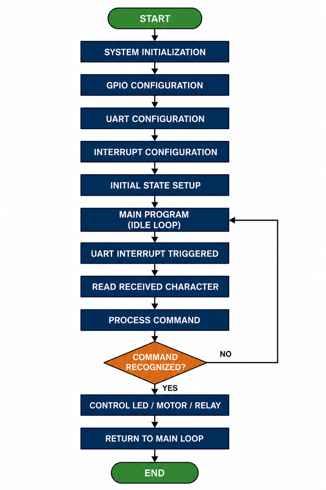
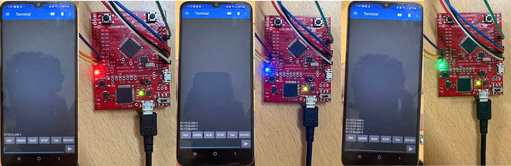
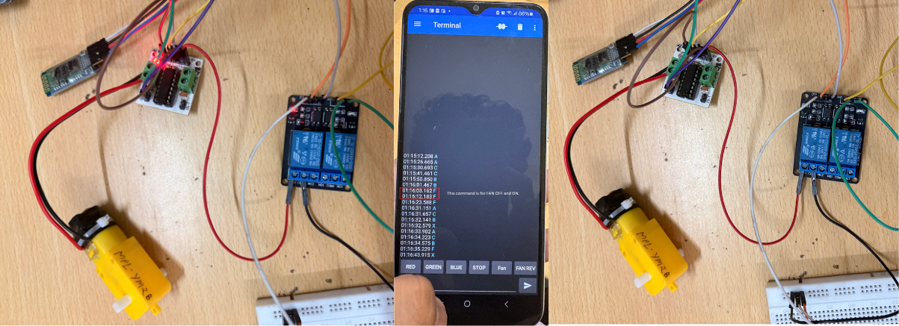
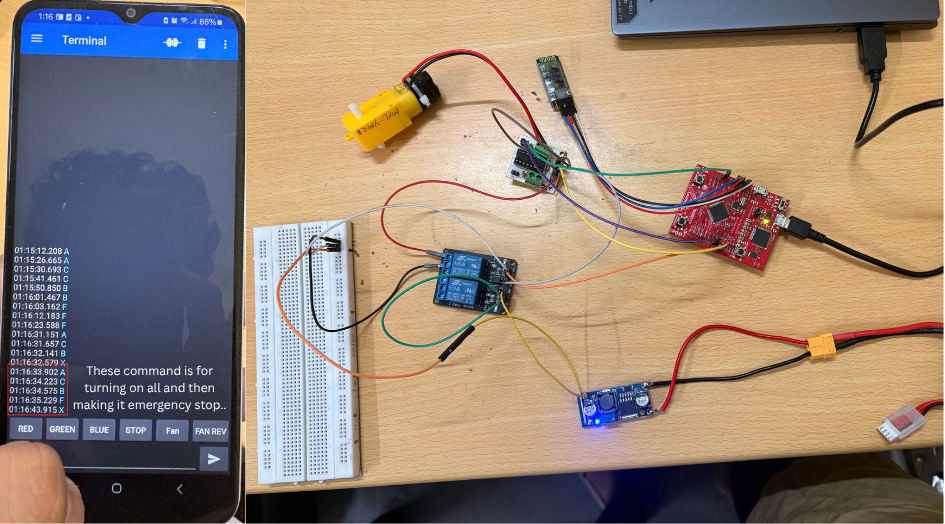

# Smartphone-Controlled Home Automation System

  

  <h3 align="center">Embedded Home Automation using Bluetooth and Tiva C</h3>

  

    Wireless control of LEDs, motor, and relay using HC-05 Bluetooth and TM4C123GH6PM
     
    <strong>Embedded Systems Design Project</strong>
      
    <a href="https://github.com/rachitsrivastava2114/Design-of-a-Smartphone-Controlled-Home-Automation-System-using-Bluetooth-and-Tiva-C/issues">Report Bug</a>
    ·
    <a href="https://github.com/rachitsrivastava2114/Design-of-a-Smartphone-Controlled-Home-Automation-System-using-Bluetooth-and-Tiva-C">View Project</a>
  

---

## Table of Contents

- [Project Overview](#project-overview)
  - [Objectives](#objectives)
  - [Key Features](#key-features)
  - [System Architecture](#system-architecture)
- [Hardware Components Used](#hardware-components-used)
- [Software \& Tools](#software--tools)
- [Pin Configuration](#pin-configuration)
- [Command Mapping](#command-mapping)
- [Working Principle](#working-principle)
- [Software Flow](#software-flow)
- [Project Visualization](#project-visualization)
- [Results](#results)
- [Applications](#applications)
- [Future Improvements](#future-improvements)
- [Author](#author)
- [License](#license)

---

## Project Overview

This project implements a **smartphone-controlled home automation system** using the **TM4C123GH6PM Tiva C LaunchPad** and an **HC-05 Bluetooth module**. It allows wireless control of **onboard LEDs**, a **DC motor/fan**, and a **relay module** through serial commands sent from a smartphone.

The system uses **UART1 communication** for Bluetooth interfacing and follows an **interrupt-driven architecture**, which improves responsiveness and reduces unnecessary CPU usage.

This project demonstrates practical concepts of:
- UART communication
- GPIO interfacing
- Interrupt handling
- Motor and relay control
- Real-time embedded system design

---

## Objectives

- Design a microcontroller-based home automation system
- Enable wireless control using a smartphone via Bluetooth
- Control LEDs, relay, and motor in real time
- Implement **interrupt-based UART communication**
- Develop a low-cost and efficient automation prototype

---

## Key Features

- 📱 Smartphone-based wireless control
- 🔵 Bluetooth communication via **HC-05**
- 💡 Control of **Red, Blue, and Green onboard LEDs**
- 🔁 Motor control in **forward** and **reverse** direction
- ⚡ Relay switching for load control
- ⚙️ Interrupt-driven command handling
- 🧠 Lightweight and efficient embedded implementation

---

## System Architecture

The system is centered around the **TM4C123GH6PM Tiva C LaunchPad**, which acts as the main controller. A smartphone sends commands through the **HC-05 Bluetooth module**, which communicates with the microcontroller through **UART1**.

Based on the received command:
- LEDs are toggled
- Motor direction is controlled
- Relay is switched ON/OFF

The relay and motor driver are powered separately for better stability, while the Tiva C board handles logic and control.

  

---

## Hardware Components Used

- **TM4C123GH6PM Tiva C LaunchPad**
- **HC-05 Bluetooth Module**
- **Relay Module**
- **L293D Motor Driver**
- **DC Motor / Fan**
- **Onboard RGB LEDs**
- **Battery**
- **Buck Converter**
- **USB Power Supply**
- Breadboard and connecting wires

---

## Software & Tools

- **Code Composer Studio (CCS)** – for Embedded C development
- **TivaWare Peripheral Driver Library** – for peripheral configuration
- **Bluetooth Serial Terminal App** – to send commands from smartphone

---

## Pin Configuration

| Tiva C Pin | Connected Device | Function |
|-----------|------------------|----------|
| PB0 | HC-05 TX | UART1 RX (receives Bluetooth data) |
| PB1 | HC-05 RX | UART1 TX (transmits data) |
| PB2 | Relay Module | Relay ON/OFF control |
| PB3 | Motor Driver IN1 | Motor forward control |
| PB4 | Motor Driver IN2 | Motor reverse control |
| PF1 | Onboard Red LED | Red LED indication |
| PF2 | Onboard Blue LED | Blue LED indication |
| PF3 | Onboard Green LED | Green LED indication |
| 5V | HC-05 VCC | Power supply |
| GND | All Modules | Common ground |

---

## Command Mapping

The system uses **single-character commands** received over UART.

| Command | Action |
|---------|--------|
| `A` | Toggle Red LED |
| `B` | Toggle Green LED |
| `C` | Toggle Blue LED |
| `F` | Toggle Motor Forward + Relay ON/OFF |
| `R` | Toggle Motor Reverse + Relay ON/OFF |
| `X` | Turn OFF all LEDs, stop motor, relay OFF |

---

## Working Principle

- The smartphone sends a command using a Bluetooth serial terminal app.
- The **HC-05** receives the command and transfers it to **UART1** of the Tiva C board.
- A **UART interrupt** is triggered whenever data arrives.
- Inside the interrupt service routine:
  - the command is read,
  - matched using a `switch-case`,
  - and the corresponding control action is executed.
- The system then returns to the idle main loop and waits for the next command.

### Operation Summary

- ✅ `A`, `B`, `C` → Toggle LEDs
- ✅ `F` → Start/Stop motor in forward direction
- ✅ `R` → Start/Stop motor in reverse direction
- ✅ `X` → Emergency stop / reset all outputs

---

## Software Flow

  

### Flow Summary

  

## Project Visualization

To understand how the data flows from the smartphone application down to the physical hardware, try the live interactive simulator:

👉 **[Launch the TM4C123 Logic Simulator](https://rachitsrivastava2114.github.io/Design-of-a-Smartphone-Controlled-Home-Automation-System-using-Bluetooth-and-Tiva-C/)**

## Results

- The onboard LEDs responded correctly to the toggle commands.
- The motor operated properly in both forward and reverse directions.
- The relay successfully switched the motor/load supply.
- The `X` command worked as an emergency stop by turning OFF all LEDs, stopping the motor, and switching OFF the relay.
- The interrupt-driven UART design provided fast response without continuous polling.

  

  <b>Figure: LED Control Result</b>

  

  <b>Figure: Motor Control Result</b>

  

  <b>Figure: All Stop Result</b>

## Applications

Used for smart home automation, wireless appliance control, smart lighting, fan/motor control, assistive technology, IoT prototyping, and embedded systems learning.

## Future Improvements

Future improvements include adding Wi-Fi/IoT control, a custom mobile app, voice control, password protection, multiple relay support, sensor-based automation, LCD status display, and PCB-based hardware design.

## Author

**Rachit Srivastava**  
Bachelor of Technology – Electronics & Communication Engineering

## License

This project is developed for academic and educational purposes only.
